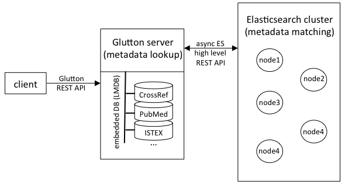

# biblio-glutton

Framework dedicated to bibliographic information. It includes:

- a bibliographical reference matching service: from an input such as a raw bibliographical reference and/or a combination of key metadata, the service will return the disambiguated bibliographical object with in particular its DOI and a set of metadata aggregated from CrossRef and other sources, 
- a fast metadata look-up service: from a "strong" identifier such as DOI, PMID, etc. the service will return a set of metadata aggregated from CrossRef and other sources,
- various mapping between DOI, PMID, PMC, ISTEX ID and ark, integrated in the bibliographical service,
- Open Access resolver: Integration of Open Access links via the Unpaywall dataset from Impactstory,
- MeSH classes mapping for PubMed articles.

The framework is designed both for speed (with several thousands request per second for look-up) and matching accuracy. It can be [scaled](https://github.com/kermitt2/biblio-glutton#architecture) horizontally as needed. 
Benchmarking against the CrossRef REST API is presented [below](https://github.com/kermitt2/biblio-glutton#matching-accuracy). 

In the Glutton family, the following complementary tools are available for taking advantage of Open Access resources: 

* [biblio-glutton-harvester](https://github.com/kermitt2/biblio-glutton-harvester): A robust, fault tolerant, Python utility for harvesting efficiently (multi-threaded) a large Open Access collection of PDF (Unpaywall, PubMed Central), with the possibility to upload content on Amazon S3,

* [biblio-glutton-extension](https://github.com/kermitt2/biblio-glutton-extension): A browser extension (Firefox & Chrome) for providing bibliographical services, like identifying dynamically Open Access resources on web pages and providing contextual citation services.

## The bibliographical look-up and matching REST API

Once the databases and index are built, the bibliographical REST API can be started. For building the databases and index, see the next sections below. 

### Build the service lookup 

You need Java JDK 1.8 installed for building and running the tool. 

```sh
cd lookup
./gradlew clean build
```

### Start the server

```sh
cd lookup/
./gradlew clean build
java -jar build/libs/lookup-service-1.0-SNAPSHOT-onejar.jar server data/config/config.yml
```

The last parameter is the path where your configuration file is located - the default path being here indicated. 

To check if it works, you can view a report of the data used by the service at `host:port/service/data`. For instance:

> curl localhost:8080/service/data

```json
{
    "Metadata Lookup Crossref size": "{crossref_Jsondoc=96491709}",
    "Metadata Matching Crossref size": "96450728",
    "DOI OA size": "{unpayWall_doiOAUrl=20246280}",
    "PMID lookup size": "{pmid_doi2ids=19648024, pmid_pmc2ids=4991296, pmid_pmid2ids=29010455}",
    "ISTEX size": "{istex_doi2ids=20999895, istex_istex2ids=21073367}"
}
```

### Start optional additional GROBID service

biblio-glutton takes advantage of GROBID for parsing raw bibliographical references. This permits faster and more accurate bibliographical record matching. To use GROBID service:

* first download and install GROBID as indicated in the [documentation](https://grobid.readthedocs.io/en/latest/Install-Grobid/)

* start the service as documented [here](https://grobid.readthedocs.io/en/latest/Grobid-service/). You can change the `port` used by GROBID by updating the service config file under `grobid/grobid-service/config/config.yaml`  

* update if necessary the host and port information of GROBID in the biblio-glutton config file under `data/config/config.yml` (parameter `grobidPath`).

While GROBID is not required for running biblio-glutton, in particular if it is used only for bibliographical look-up, it is recommended for performing bibliographical record matching. 


### Running with Docker

A Docker Compose file is included to make it easier to spin up biblio-glutton, Elasticsearch, and GROBID.

First, [install Docker](https://docs.docker.com/install/).

Then, run this command to spin everything up:

    $ docker-compose up --build -d

You can run this command to see aggregated log output:

    $ docker-compose logs

Once everything has booted up, biblio-glutton will be running at http://localhost:8080 and GROBID will be at http://localhost:8070.

To load data, you can use the `docker-compose run` command. The `data/` directory is mounted inside the container. For example, this command will load Crossref data (as described in more detail [below](https://github.com/kermitt2/biblio-glutton#resources)):

    $ docker-compose run biblio java -jar lookup/build/libs/lookup-service-1.0-SNAPSHOT-onejar.jar crossref --input data/crossref-works.2018-09-05.json.xz lookup/data/config/config.yml

You will need to load similarly the other resources, as detailed [here](https://github.com/kermitt2/biblio-glutton#resources). 

__Important Note__: this Docker is a way to test and play with the biblio-glutton service, because all the service components are bundled into one container. It might also fit simple needs. However, it is not a solution for scaling and deploying a service requiring high performance bibliographic matching, see [this section](https://github.com/kermitt2/biblio-glutton#building-the-bibliographical-data-look-up-and-matching-databases) for more information. 


### REST API

- match record by DOI
    - `GET host:port/service/lookup?doi=DOI`
    - `GET host:port/service/lookup/doi/{DOI}`

- match record by PMID
    - `GET host:port/service/lookup?pmid=PMID`
    - `GET host:port/service/lookup/pmid/{PMID}`

- match record by PMC ID
    - `GET host:port/service/lookup?pmc=PMC`
    - `GET host:port/service/lookup/pmc/{PMC}`

- match record by ISTEX ID
    - `GET host:port/service/lookup?istexid=ISTEXID`
    - `GET host:port/service/lookup/istexid/{ISTEXID}`
            
- match record by PII ID
    - `GET host:port/service/lookup?pii=PII`
    - `GET host:port/service/lookup/pii/{PII}`   

- match record by article title and first author lastname
    - `GET host:port/service/lookup?atitle=ARTICLE_TITLE&firstAuthor=FIRST_AUTHOR_SURNAME[?postValidate=true]`
    
    The post validation optional parameter avoids returning records whose title and first author are too different from the searched ones.

- match record by journal title or abbreviated title, volume and first page
    - `GET host:port/service/lookup?jtitle=JOURNAL_TITLE&volume=VOLUME&firstPage=FIRST_PAGE`

- match record by journal title or abbreviated title, volume, first page, and first author lastname
    - `GET host:port/service/lookup?jtitle=JOURNAL_TITLE&volume=VOLUME&firstPage=FIRST_PAGE&firstAuthor=FIRST_AUTHOR_SURNAME`

- match record by raw citation string 
    - `GET host:port/service/lookup?biblio=BIBLIO_STRING&`
    - `POST host:port/service/lookup/biblio` with `ContentType=text/plain` 

Any combinations of these metadata and full raw citation string is possible, for instance: 

    - `GET host:port/service/lookup?biblio=BIBLIO_STRING&atitle=ARTICLE_TITLE&firstAuthor=FIRST_AUTHOR_SURNAME[?postValidate=true]`

or:

    - `GET host:port/service/lookup?jtitle=JOURNAL_TITLE&volume=VOLUME&firstPage=FIRST_PAGE&firstAuthor=FIRST_AUTHOR_SURNAME&atitle=ARTICLE_TITLE`

biblio-glutton will make the best use of all the parameters sent to retrieve in the fastest way a record and to post-validate it to avoid false positive. See [#12](https://github.com/kermitt2/biblio-glutton/issues/12). So it is advised to send as much metadata as possible to try to optimize the DOI matching in term of speed and accuracy.  

In case you are only interested by the Open Access URL for a bibliographical object, the open Access resolver API returns the OA PDF link (URL) only via an identifier: 

- return the best Open Access URL if available
    - `GET host:port/service/oa?doi=DOI` return the best Open Accss PDF url for a given DOI 
    - `GET host:port/service/oa?pmid=PMID` return the best Open Accss PDF url for a given PMID 
    - `GET host:port/service/oa?pmc=PMC` return the best Open Accss PDF url for a given PMC ID
    - `GET host:port/service/oa?pii=PII` return the best Open Accss PDF url for a given PII ID

- return the best Open Access URL and ISTEX PDF URL if available
    - `GET host:port/service/oa_istex?doi=DOI` return the best Open Accss PDF url and ISTEX PDF url for a given DOI 
    - `GET host:port/service/oa_istex?pmid=PMID` return the best Open Accss PDF url and ISTEX PDF url for a given PMID 
    - `GET host:port/service/oa_istex?pmc=PMC` return the best Open Accss PDF url and ISTEX PDF url for a given PMC ID
    - `GET host:port/service/oa_istex?pii=PII` return the best Open Accss PDF url and ISTEX PDF url for a given PII ID

### cURL examples

To illustrate the usage of the API, we provide some cURL example queries:

Bibliographical metadata lookup by DOI:

```sh
curl http://localhost:8080/service/lookup?doi=10.1484/J.QUAESTIO.1.103624
```

Matching with title and first authort lastname:

```sh
curl "http://localhost:8080/service/lookup?atitle=Naturalizing+Intentionality+between+Philosophy+and+Brain+Science.+A+Survey+of+Methodological+and+Metaphysical+Issues&firstAuthor=Pecere&postValidate=true"

curl "http://localhost:8080/service/lookup?atitle=Naturalizing+Intentionality+between+Philosophy+and+Brain+Science&firstAuthor=Pecere&postValidate=false"
```

Matching with raw bibliographical reference string:

```sh
curl "http://localhost:8080/service/lookup?biblio=Baltz,+R.,+Domon,+C.,+Pillay,+D.T.N.+and+Steinmetz,+A.+(1992)+Characterization+of+a+pollen-specific+cDNA+from+sunflower+encoding+a+zinc+finger+protein.+Plant+J.+2:+713-721"
```

Bibliographical metadata lookup by PMID (note that only the number is expected):

```sh
curl http://localhost:8080/service/lookup?pmid=1605817
```

Bibliographical metadata lookup by PMC ID (note that the `PMC` prefix in the identifier is expected):

```sh
curl http://localhost:8080/service/lookup?pmc=PMC1017419
```

Bibliographical metadata lookup by PII ID:

```sh
curl http://localhost:8080/service/lookup?pii=
```

Bibliographical metadata lookup by ISTEX ID:

```sh
curl http://localhost:8080/service/lookup?istexid=E6CF7ECC9B002E3EA3EC590E7CC8DDBF38655723
```

Open Access resolver by DOI:

```sh
curl "http://localhost:8080/service/oa?doi=10.1038/nature12373"
```

Combination of Open Access resolver and ISTEX identifier by DOI:

```sh
curl "http://localhost:8080/service/oa_istex?doi=10.1038/nature12373"
```

## Building the bibliographical data look-up and matching databases

### Architecture

Below is an overview of the biblio-glutton architecture. The biblio-glutton server manages locally high performance LMDB databases for all metadata look-up tasks (several thousand requests per second with multiple threads). For the costly metadata matching tasks, an Elasticsearch cluster is used. For scaling this sort of queries, simply add more nodes in this elasticsearch cluster, keepping a single biblio-glutton server instance. 

 

#### Scaling evaluation

1) *Metadata Lookup*

One glutton instance: 19,792,280 DOI lookup in 3156 seconds, ~ 6270 queries per second. 

2) *Bibliographical reference matching* 

*(to be completed with more nodes!)*
 
Processing time for matching 17,015 raw bibliographical reference strings to DOI:

| number of ES cluster nodes | comment  | total runtime (second) | runtime per bib. ref. (second)   | queries per second |
|----|---|---|---|---|
|  1 | glutton and Elasticsearch node share the same machine   | 2625  | 0.154  |  6.5  |
|  1 | glutton and Elasticsearch node on two separate machines   | 1990  | 0.117  |  8.5 |
|  2 | glutton and one of the Elasticsearch node sharing the same machine  |  1347  |  0.079  | 12.6  |

Machines have the same configuration Intel i7 4-cores, 8 threads, 16GB memory, SSD, on Ubuntu 16.04.

### Resources

For building the database and index used by service, you will need these resources:

* CrossRef metadata dump: available via the [Crossref Metadata APIs Plus](https://www.crossref.org/services/metadata-delivery/plus-service/) service or at Internet Archive, see https://github.com/greenelab/crossref,

* DOI to PMID and PMC mapping: available at Europe PMC, see ftp://ftp.ebi.ac.uk/pub/databases/pmc/DOI/,

* optionally, the Unpaywall dataset, to get Open Access links aggregated with the bibliographical metadata,

* optionally, for getting ISTEX identifier informations, you need to build the ISTEX ID mapping, see bellow. 

The bibliographical matching service uses a combination of high performance embedded databases (LMDB), for fast look-up and cache, and Elasticsearch for text-based search. As Elasticsearch is much slower than embedded databases, it is used only when absolutely required. 

The databases and elasticsearch index must first be built from the resource files. The full service needs around 300GB of space for building these index and it is highly recommended to use SSD for best performance.

### Build the embedded LMDB databases

Resource dumps will be compiled in high performance LMDB databases. The system can read compressed or plain text files files (`gzip` or `.xz`), so in practice you do not need to uncompress anything.

#### Build the data loader 

```sh
cd lookup
./gradlew clean build
```

All the following commands need to be launched under the subdirectory `lookup/`. The loading of the following database can be done in parallel. 

#### CrossRef metadata

```sh
java -jar build/libs/lookup-service-1.0-SNAPSHOT-onejar.jar crossref --input /path/to/crossref/json/file /path/to/your/configuration
```

Example (XZ files will be streamed directly from the compressed versions): 

```sh
java -jar build/libs/lookup-service-1.0-SNAPSHOT-onejar.jar crossref --input crossref-works.2018-09-05.json.xz data/config/config.yml
```

**Note:** by default the `abstract`, the `reference` and the original `indexed` fields included in CrossRef records are ignored to save some disk  space. The `reference` field is often particularly large as it lists all the citations for almost half of the DOI records. You can change the list of fields to be filtered out in the config file under `data/config/config.yml`, by editing the lines:

```
ignoreCrossRefFields:                                                   
  - reference
  - abstract
  - indexed
```

#### PMID and PMC ID

```sh
java -jar build/libs/lookup-service-1.0-SNAPSHOT-onejar.jar pmid --input /path/to/pmid/csv/file /path/to/your/configuration 
```

Example: 

```sh
java -jar build/libs/lookup-service-1.0-SNAPSHOT-onejar.jar pmid --input PMID_PMCID_DOI.csv.gz data/config/config.yml 
```

#### OA via Unpaywall

```sh
java -jar build/libs/lookup-service-1.0-SNAPSHOT-onejar.jar unpaywall --input /path/to/unpaywall/json/file /path/to/your/configuration
```

Example: 

```sh
java -jar build/libs/lookup-service-1.0-SNAPSHOT-onejar.jar unpaywall --input unpaywall_snapshot_2018-09-24T232615.jsonl.gz data/config/config.yml 
```

#### ISTEX

```sh
java -jar build/libs/lookup-service-1.0-SNAPSHOT-onejar.jar istex --input /path/to/istex/json/file /path/to/your/configuration
```

Example: 

```sh
java -jar build/libs/lookup-service-1.0-SNAPSHOT-onejar.jar istex --input istexIds.all.gz data/config/config.yml
```

Note: see bellow how to create this mapping file `istexIds.all.gz`. 

### Build the Elasticsearch index

Elasticsearch 6 is required. It is not compatible with Elasticsearch >=7.

A node.js utility under the subdirectory `matching/` is used to build the Elasticsearch index. It will take a couple of hours for the 100M crossref entries.

#### Install and configure

You need first to install and start ElasticSearch, latest version. Replace placeholder in the file `my_connection.js` to set the host name and port of the Elasticsearch server. 

Install the node.js module:

```sh
cd matching/
npm install
```

#### Build the index 

```sh
node main -dump *PATH_TO_THE_CROSSREF_JSON_DUMP* index
```

Example:

```sh
node main -dump ~/tmp/crossref-works.2018-09-05.json.xz index
```

Note than launching the above command will fully re-index the data, deleting existing index. The default name of the index is `crossref`, but this can be changed via the config file `matching/config.json`.


## Matching accuracy

Here is some evaluation on the bibliographical reference matching.

### Dataset

We created a dataset of [17,015 bibliographical reference/DOI pairs](doc/references-doi-matching.json.gz) with GROBID and the PMC 1943 sample (a set of 1943 PubMed Central articles from 1943 different journals with both PDF and XML NLM files available, see below). For the bibliographical references present in the NLM file with a DOI, we try to align the raw reference string extracted from the PDF by GROBID and the parsed XML present in the NLM file. Raw reference string are thus coming from the PDF, and we included additional metadata as extracted by GROBID from the PDF. 

Example of the two first of the 17.015 entries: 

```json
{"reference": "Classen M, Demling L. Endoskopishe shinkterotomie der papilla \nVateri und Stein extraction aus dem Duktus Choledochus [Ger-\nman]. Dtsch Med Wochenschr. 1974;99:496-7.", "doi": "10.1055/s-0028-1107790", "pmid": "4835515", "atitle": "Endoskopishe shinkterotomie der papilla Vateri und Stein extraction aus dem Duktus Choledochus [German]", "firstAuthor": "Classen", "jtitle": "Dtsch Med Wochenschr", "volume": "99", "firstPage": "496"},
{"reference": "Kawai K, Akasaka Y, Murakami K. Endoscopic sphincterotomy \nof the ampulla of Vater. Gastrointest Endosc. 1974;20:148-51.", "doi": "10.1016/S0016-5107(74)73914-1", "pmid": "4825160", "atitle": "Endoscopic sphincterotomy of the ampulla of Vater", "firstAuthor": "Kawai", "jtitle": "Gastrointest Endosc", "volume": "20", "firstPage": "148"},
```

The goal of Glutton matching is to identify the right DOI from raw metadata. We compare the results with the CrossRef REST API, using the `query.bibliographic` field for raw reference string matching, and author/title field queries for first author lastname (`query.author`) plus title matching (`query.title`). 

Limits: 

- The DOI present in the NLM files are not always reliable (e.g. DOI not valid anymore following some updates in CrossRef). A large amount of the matching errors are actually not due to the matching service, but to NLM reference DOI data quality. However, errors will be the same for all matching services, so it's still valid for comparing them, although for this reason the resulting accuracy is clearly lower than what it should be.

- GROBID extraction is not always reliable, as well the alignment mechanism with NLM (based on soft match), and some raw reference string might not be complete or include unexpected extra material from the PDF. However, this can be view as part of the matching challenge in real world conditions! 

- the NLM references with DOI are usually simpler reference than in general: there are much fewer abbreviated references (without title nor authors) and references without titles as compared to general publications from non-medicine publishers. 


### How to run the evaluation

You can use the DOI matching evaluation set (with 17,015 bibliographical reference/DOI pairs) from the indicated above address ([here](doc/references-doi-matching.json.gz)) or recreate this dataset with GROBID as follow:

- [Install GROBID](https://grobid.readthedocs.io/en/latest/Install-Grobid/).

- Download the [PMC 1943 sample](https://grobid.s3.amazonaws.com/PMC_sample_1943.zip) (around 1.5GB in size).

- Create the evaluation dataset:

> ./gradlew PrepareDOIMatching -Pp2t=ABS_PATH_TO_PMC/PMC_sample_1943 
    
The evaluation dataset will be saved under `ABS_PATH_TO_PMC/PMC_sample_1943` with the name `references-doi-matching.json`

- For launching an evaluation: 

1) Select the matching method (`crossref` or `glutton`) in the `grobid-home/config/grobid.properties` file: 


```
#-------------------- consolidation --------------------
# Define the bibliographical data consolidation service to be used, eiter "crossref" for CrossRef REST API or "glutton" for https://github.com/kermitt2/biblio-glutton
#grobid.consolidation.service=crossref
grobid.consolidation.service=glutton
```

2) If Glutton is setected, start the Glutton server as indicated above (we assume that it is running at `localhost:8080`).

3) Launch from GROBID the evaluation, indicating the path where the evaluation dataset has been created - here we suppose that the file `references-doi-matching.json` has been saved under `ABS_PATH_TO_PMC/PMC_sample_1943`: 

> ./gradlew EvaluateDOIMatching -Pp2t=ABS_PATH_TO_PMC/PMC_sample_1943


### Full raw bibliographical reference matching

Runtime correspond to a processing on a single machine running Glutton REST API server, ElasticSearch and GROBID evaluation. In the case of CrossRef API, we use as much as possible the 50 queries per second allowed by the service with the GROBID CrossRef multithreaded client. 

```
======= GLUTTON API ======= 

17015 bibliographical references processed in 2363.978 seconds, 0.13893493975903615 seconds per bibliographical reference.
Found 16462 DOI

precision:      0.9699307496051512
recall: 0.9384072876873347
f-score:        0.953908653702542

```

```
======= CROSSREF API ======= 

17015 bibliographical references processed in 793.295 seconds, 0.04662327358213341 seconds per bibliographical reference.
Found 16449 DOI

precision:      0.9671104626421059
recall: 0.9349397590361446
f-score:        0.9507530480516376

```

Evaluation produced on 13.02.2019.

### First author lastname + title matching 

```
======= GLUTTON API ======= 

17015 bibliographical references processed in 673.698 seconds, 0.039594357919482806 seconds per bibliographical reference.
Found 16165 DOI

precision:      0.9466749149396845
recall: 0.8993828974434322
f-score:        0.9224231464737793

```

```
======= CROSSREF API ======= 

17015 bibliographical references processed in 781.618 seconds, 0.04593699676755804 seconds per bibliographical reference.
Found 15048 DOI

precision:      0.9356060606060606
recall: 0.8274463708492507
f-score:        0.8782085269625426
```

Evaluation produced on 13.02.2019.

### Mixed strategy

We process bibliographical references with a first author lastname+title matching, then journal name+volume+page when these metadata are extracted by GROBID, and finally a full raw reference string matching is only done when metadata-based look-ups fail. 
We get a much faster matching rate (3 times faster), at the cost of some accuracy loss (-2. f-score). 

```
======= GLUTTON API ======= 

17015 bibliographical references processed in 824.658 seconds, 0.04846652953276521 seconds per bibliographical reference.
Found 16546 DOI

precision:      0.9469962528707845
recall: 0.9208933294152218
f-score:        0.9337624027889514

```

Evaluation produced on 13.02.2019.

## ISTEX mapping

If you don't know what ISTEX is, you can safely skip this section.

### ISTEX identifier mapping

For creating a dump of all ISTEX identifiers associated with existing identifiers (DOI, ark, PII), use the node.js script as follow:

* install:

```sh
cd scripts
npm install requestretry
```

* Generate the json dump:

```sh
node dump-istexid-and-other-ids.js > istexIds.all
```

Be sure to have a good internet bandwidth for ensuring a high rate usage of the ISTEX REST API.

You can then move the json dump (e.g. `istexIds.all`) to the Istex data path indicated in the file `config/glutton.yaml` (by default `data/istex/`). 

### ISTEX to PubMed mapping

The mapping adds PudMed information (in particular MeSH classes) to ISTEX entries. 
See the instructions [here](pubmed-glutton/Readme.md)

## Main authors and contact

- Patrice Lopez ([@kermitt2](https://github.com/kermitt2), patrice.lopez@science-miner.com)

- Luca Foppiano ([@lfoppiano](https://github.com/lfoppiano))

## License

Distributed under [Apache 2.0 license](http://www.apache.org/licenses/LICENSE-2.0). 
