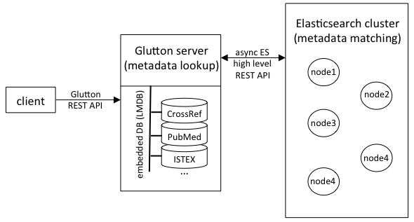

## The bibliographical look-up and matching REST API


### Architecture

Below is an overview of the biblio-glutton architecture. The biblio-glutton server manages locally high performance LMDB databases for all metadata look-up tasks (several thousand requests per second with multiple threads). For the costly metadata matching tasks, an Elasticsearch cluster is used. For scaling this sort of matching queries, simply add more nodes to this elasticsearch cluster, keepping a single biblio-glutton server instance. 

 

#### Runtime evaluation

1) *Metadata Lookup*

One glutton instance: 19,792,280 DOI lookup in 3156 seconds, ~ 6270 queries per second. 

2) *Bibliographical reference matching* 

*(to be completed with more nodes!)*
 
Processing time for matching 17,015 raw bibliographical reference strings to DOI:

| number of ES cluster nodes | comment  | total runtime (second) | runtime per bib. ref. (second)   | queries per second |
|----|---|---|---|---|
|  1 | glutton and Elasticsearch node share the same machine   | 2625  | 0.154  |  6.5  |
|  1 | glutton and Elasticsearch node on two separate machines   | 1990  | 0.117  |  8.5 |
|  2 | glutton and one of the Elasticsearch node sharing the same machine  |  1347  |  0.079  | 12.6  |

Machines have the same configuration Intel i7 4-cores, 8 threads, 16GB memory, SSD, on Ubuntu 16.04.

The first step to deploy a biblio-glutton instance is to to create the bibliographical databases and search index, see the page [Build-Databases](Build-Databases.md) for detailed explanation. 

After installing all or a selection of bibliographical databases, the bibliographical REST API can be started. 

The following describes how to build and start the bibliographical service. 

### Install Elasticsearch

The matching needs an Elasticsearch node; the lookups by identifier work without one. The current
version is tested with Elasticsearch 8 (8.19). A node that holds the whole of Crossref needs
around 60 GB of disk for the index and 8 GB of memory or more.

**OpenSearch is not supported.** The Elasticsearch clients biblio-glutton is built with check that
the server is Elasticsearch and speak the version 8 media type, and OpenSearch refuses both: tried
against OpenSearch 2.19, the index creation and every bulk are answered with
`406 Not Acceptable`, and the client reports `Missing [X-Elastic-Product] header`.

#### With Docker

A single node for a local installation, without security, reachable from this machine only:

```sh
docker run -d --name glutton-elasticsearch \
  -p 127.0.0.1:9200:9200 \
  -e discovery.type=single-node \
  -e xpack.security.enabled=false \
  -e ES_JAVA_OPTS="-Xms4g -Xmx4g" \
  -v glutton-esdata:/usr/share/elasticsearch/data \
  docker.elastic.co/elasticsearch/elasticsearch:8.19.4
```

- `-p 127.0.0.1:9200:9200` keeps the node off the network. Without security, anything that can
  reach the port can read and delete the index, so do not publish it on `0.0.0.0`.
- `-v glutton-esdata:...` keeps the index in a named volume, so that it outlives the container.
  Without it the index is lost with the container, and has to be rebuilt with `./gradlew index`.
- `ES_JAVA_OPTS` sets the heap. Give it half the memory meant for Elasticsearch, the other half
  is for the file cache; 4 GB is enough for a full Crossref index on one node.

Check that it answers, which takes half a minute after the start:

```sh
curl http://localhost:9200
```

Then point biblio-glutton at it in `config/glutton.yml`:

```yaml
elastic:
  host: localhost:9200
  index: glutton
```

The index itself is not to be created by hand: the loading commands create it, with its
mapping, the first time they run (see [Build the databases](Build-Databases.md)).

On Linux, Elasticsearch may stop at start with `max virtual memory areas vm.max_map_count [65530]
is too low`. Raise it on the host, and in `/etc/sysctl.conf` for it to survive a restart:

```sh
sudo sysctl -w vm.max_map_count=262144
```

On macOS and Windows, give Docker Desktop at least 6 GB of memory (Settings, Resources), or the
container is killed while loading.

#### With Docker Compose

The same node as a `docker-compose.yml`:

```yaml
services:
  elasticsearch:
    image: docker.elastic.co/elasticsearch/elasticsearch:8.19.4
    container_name: glutton-elasticsearch
    environment:
      - discovery.type=single-node
      - xpack.security.enabled=false
      - ES_JAVA_OPTS=-Xms4g -Xmx4g
    ulimits:
      memlock:
        soft: -1
        hard: -1
      nofile:
        soft: 65536
        hard: 65536
    ports:
      - "127.0.0.1:9200:9200"
    volumes:
      - esdata:/usr/share/elasticsearch/data
    healthcheck:
      test: ["CMD-SHELL", "curl -fs http://localhost:9200/_cluster/health || exit 1"]
      interval: 10s
      timeout: 5s
      retries: 12
    restart: unless-stopped

volumes:
  esdata:
```

```sh
docker compose up -d        # start
docker compose ps           # "healthy" once the node answers
docker compose logs -f elasticsearch
docker compose down         # stop, the index stays in the volume
docker compose down -v      # stop and delete the index
```

#### With security on

For a node that is reachable by others, turn the security on and give a password. With Docker:

```sh
docker run -d --name glutton-elasticsearch \
  -p 9200:9200 \
  -e discovery.type=single-node \
  -e xpack.security.enabled=true \
  -e xpack.security.http.ssl.enabled=false \
  -e ELASTIC_PASSWORD=choose-a-password \
  -e ES_JAVA_OPTS="-Xms4g -Xmx4g" \
  -v glutton-esdata:/usr/share/elasticsearch/data \
  docker.elastic.co/elasticsearch/elasticsearch:8.19.4
```

With Docker Compose, replace the `environment` block above with:

```yaml
    environment:
      - discovery.type=single-node
      - xpack.security.enabled=true
      - xpack.security.http.ssl.enabled=false
      - ELASTIC_PASSWORD=${ELASTIC_PASSWORD}
      - ES_JAVA_OPTS=-Xms4g -Xmx4g
```

and the health check test with
`curl -fs -u elastic:$$ELASTIC_PASSWORD http://localhost:9200/_cluster/health || exit 1`. The
password is read from a `.env` file next to `docker-compose.yml` (`ELASTIC_PASSWORD=...`), which
is not to be committed.

```sh
curl -u elastic:choose-a-password http://localhost:9200
```

and in `config/glutton.yml`:

```yaml
elastic:
  host: localhost:9200
  index: glutton
  username: elastic
  password: choose-a-password
  # the password travels in clear on plain http: only for a node on the same machine or on a
  # network you trust. Behind TLS, give the host as https://... and leave this out
  allowCredentialsOverHttp: true
```

An API key can be used in place of the user and password (`elastic.apiKey`). If the credentials
are refused, `/service/health` says `unauthorized` for Elasticsearch, see [Health](API.md#health).

### Build the service

You need **Java JDK 21 (LTS)** installed for building and running the tool. The Gradle wrapper is configured with a Java 21 toolchain — if your default `java` is older, the [Foojay toolchain resolver](https://github.com/gradle/foojay-toolchains) will automatically download and provision a JDK 21 on first build. To install Java 21 manually, use [SDKMAN!](https://sdkman.io) or [Eclipse Temurin](https://adoptium.net/temurin/releases/?version=21).

```sh
./gradlew clean build
```

### Start the server

```sh
./gradlew server
```

The service will use the default project configuration located under `biblio-glutton/config/glutton.yml`. To select a configuration file in another location use the additional parameter `-Pconfig=/other/path/glutton.yml` as follow: 

```sh
./gradlew server -Pconfig=/other/path/glutton.yml
```

To check if it works, you can view a report of the data used by the service at `host:port/service/data`. For instance:

> curl localhost:8080/service/data

```json
{
  "ISTEX size (LMDB)": "{istex_doi2ids=0, istex_istex2ids=0, istex_pii2ids=0}",
  "Crossref metadata stored size": "{crossref_Jsondoc=149817829}",
  "Crossref metadata indexed size (elastic)": "{glutton=149812959}",
  "HAL Metadata stored size (LMDB)": "{hal_Jsondoc=3780904}",
  "PMID size (LMDB)": "{pmid_doi2ids=946688, pmid_pmc2ids=850087, pmid_pmid2ids=1287533}",
  "DOI OA size (LMDB)": "{openAccess_doiOAUrl=0}"
}
```

Each item represent a data storage. By default they are LMDB storage and their databases (e.g. for PMID there are three databases `pmid_doi2ids` which stored the lookup from doi to PMID, etc..) except for `Total Metadata indexed size` which measure the records indexed in Elasticsearch (the name, like in this case `glutton` is the configured index name). 

### Start optional additional GROBID service

biblio-glutton takes advantage of GROBID for parsing raw bibliographical references. This permits faster and more accurate bibliographical record matching. To use GROBID service:

* First download and install GROBID as indicated in the [documentation](https://grobid.readthedocs.io/en/latest/Install-Grobid/), normally as a docker image to take advantage of Deep Learning models for more accurate parsing of bibliographical references. **Recommended Grobid version: 0.9.1** (see [Grobid releases](https://github.com/kermitt2/grobid/releases)). biblio-glutton communicates with Grobid only via HTTP (the `/api/isalive` and `/api/processCitation` endpoints), whose contract is unchanged across Grobid 0.7.x, 0.8.x and 0.9.x, so any of those releases is API-compatible.

* Start the service as documented [here](https://grobid.readthedocs.io/en/latest/Grobid-service/). You can change the `port` used by GROBID when starting the docker container, or by updating the service config file under `grobid/grobid-home/config/grobid.yaml`.

* Update if necessary the host and port information of GROBID in the biblio-glutton config file under `biblio-glutton/config/glutton.yml` (parameter `grobidHost`).

While GROBID is not required for running biblio-glutton, in particular if it is used only for bibliographical look-up, it is strongly recommended for performing bibliographical record matching. And vice-vera, configuration the biblio-glutton service for Grobid will provide high quality consolidation services to resolve the bibliographical references automatically extracted by Grobid. 

### Troubleshooting

#### Startup fails with `Unrecognized field at: server.maxQueuedRequests`

biblio-glutton runs on Dropwizard 5 (Jetty 12), which removed the `server.maxQueuedRequests`
setting. If you carried an older `glutton.yml` over, delete that line - the service will not
start while it is present. The application-level `maxAcceptedRequests` setting is unaffected
and remains the knob that caps concurrent work.

#### Issues with the elasticsearch index  

It might happens that logs from Grobid show messages with error 503: 
```
INFO  [2024-08-30 12:50:17,897] org.grobid.core.utilities.Consolidation: Consolidation service returns error (503) : Service Unavailable
```
corresponding to the following error on the biblio-glutton side: 
```
35.175.72.198 - - [30/Aug/2024:12:21:13 +0000] "GET /service/lookup?parseReference=false&atitle=Latent+Dirichlet+Allocation&firstAuthor=Blei HTTP/1.1" 503 0 "-" "Apache-HttpClient/4.5.3 (Java/17.0.11)" 1710
```

This is biblio-glutton saying it cannot reach Elasticsearch, or that the index is not there. Ask
the service itself what it sees:
```
curl http://localhost:8080/service/health
```
The answer says which of the storage and Elasticsearch is the problem and why (see [Health](API.md#health)),
and the biblio-glutton log has a line starting with `ELASTICSEARCH IS NOT AVAILABLE` from the
moment it went away. The lookups by identifier keep working from the storage meanwhile:
```
curl http://localhost:8080/service/lookup?doi=10.1371/journal.pone.0265361
```
while the direct matching queries answer 503 until Elasticsearch is back:
```
curl http://localhost:8080/service/lookup?parseReference=false&atitle=Latent+Dirichlet+Allocation&firstAuthor=Blei
```

NOTE that code 404 or 400 are normal and should not be considered as an error: 404 is a record that
was not found, 400 a query without enough to search with.

## Upgrading from 0.3

Unpaywall is no longer a source of Open Access links: it was folded into OpenAlex, whose last
public Unpaywall snapshot dates from 2022. The `unpaywall` command is gone, replaced by
`openalex` (see [Build the databases](Build-Databases.md#oa-via-openalex)).

The storage that holds these links was renamed from `unpayWall` to `openAccess` at the same time.
A database built by 0.3 is not read by 0.4.0, and renaming the directory does not carry it over,
because the database inside it is named after Unpaywall as well. Reload the links:

```sh
./gradlew openalex -Pinput=s3://openalex/data/jsonl/works/
```

then delete the old `unpayWall` directory under your storage path. Nothing else in the storage is
affected, so Crossref, PubMed, HAL and ISTEX do not need reloading. The service says so on start
if it finds the old directory next to an empty new one.

The Crossref and HAL records are now compressed with Zstandard and a dictionary instead of snappy,
which makes them about a third of the size (see [Compression of the stored
records](Build-Databases.md#compression-of-the-stored-records)). A database written by 0.3 is read
as before, and the daily updates simply write the new format next to the old records, so nothing
needs to be done. The existing records keep their old size though: to get the smaller database,
reload the Crossref dump (and HAL) with 0.4.0. Setting `compression: snappy` in `config/glutton.yml`
keeps writing the 0.3 format instead.
